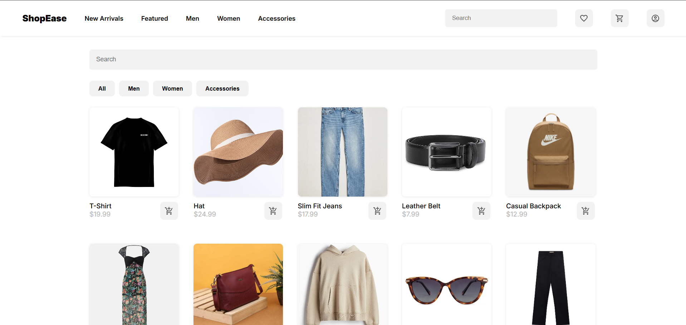
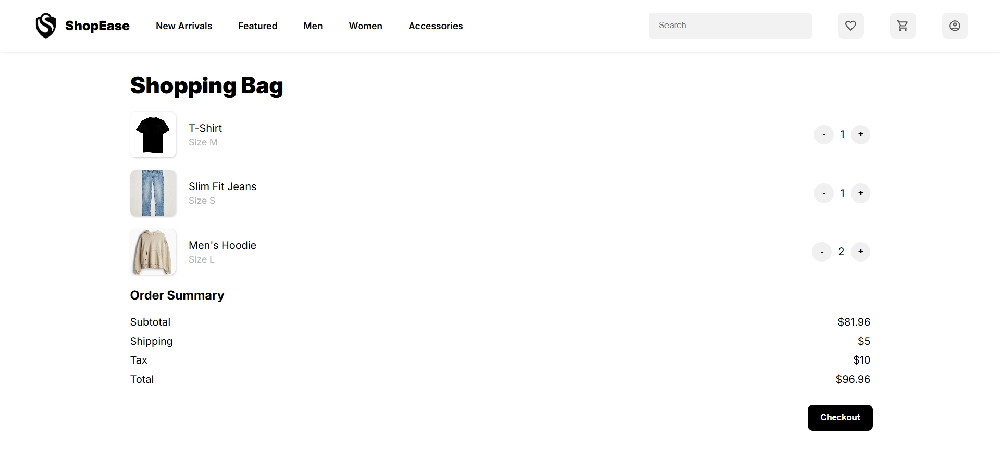

# 🛒 ShopEase

A simple and responsive shopping cart web app built with **React.js**. ShopEase allows users to browse products, filter by category, and manage a shopping cart — all in a clean and intuitive UI.

---

## 🚀 Features

- ✅ Product listing with images and descriptions  
- ✅ Category-based filtering  
- ✅ Add to cart functionality  
- ✅ Quantity increment/decrement  
- ✅ Cart persistence using LocalStorage  
- ✅ Responsive design using CSS Grid & Flexbox  

---

## 🖼️ Screenshots

  


---

## 📦 Tech Stack

- React.js (`useState`, `useEffect`)
- JavaScript (ES6+)
- CSS3
- Vite (Build Tool)

---

## 🔧 Installation

```bash
# Clone the repository
git clone https://github.com/akashogz/ShopEase.git

# Navigate into the directory
cd ShopEase

# Install dependencies
npm install

# Run the development server
npm run dev
