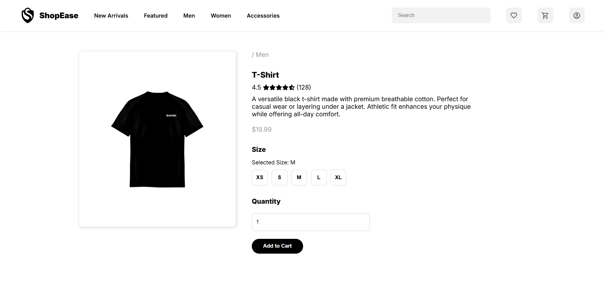
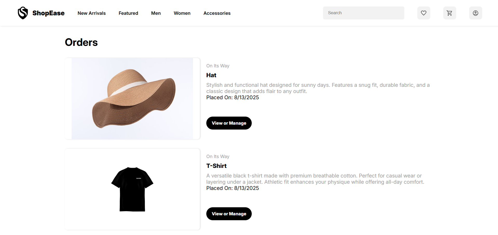

# ShopEase - Beginner E-Commerce React Project

Welcome to **ShopEase**, a simple and beginner-friendly e-commerce frontend built with React.  
This project demonstrates basic React concepts like state management, component structure, and simple UI interactions like adding to cart, viewing orders, and filtering products.

---

## Features

- Browse products by category (Men, Women, Accessories, All)  
- Search products by name  
- View detailed product page with size and quantity options  
- Add products to shopping cart  
- Update cart quantities and checkout  
- View placed orders with status  
- Simple responsive layout using plain CSS (no frameworks)

---

## Screenshots

### Main Page  

### Product Page  

### Cart Page  

### Orders Page  

---

## Getting Started
1. Clone the repository:  
git clone https://github.com/akashogz/ShopEase.git
2. Install dependencies:
npm install
3. Run the app locally:
npm start

---

## Tech Stack

- React (Functional Components & Hooks)  
- Plain CSS for styling  
- No backend (data is static, stored in local state)

---

## Notes

- This is a beginner-level project created for learning and practice purposes.  
- No backend or persistent data storage implemented.  
- Styling is kept simple without CSS frameworks.

---

## License

This project is open source and free to use.

---

Thank you for checking out ShopEase!  
Feel free to contribute or suggest improvements.
